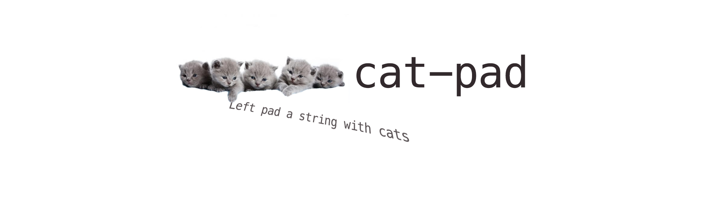

# 

## Install

```
$ npm install cat-pad
```

## Usage

```js
import catPad from 'cat-pad';

catPad('Meow', 6);
//=> '🐈🐈Meow'
```

## API

### catPad(input, length)

Pads `input` with cats on the left side if it's shorter than `length`. Padding cats are truncated if they exceed `length`.

#### input

Type: `string`

String to pad.

#### length

Type: `number`\
Default: `0`

Padding length.
